# 🦫 Beaver IM - 海狸即时通讯移动端

> 🚀 **现代化移动端即时通讯应用** - 基于 Flutter + Dart 构建，支持 Android/iOS/Web，提供完整的社交聊天体验

**当前版本：[2.0.1](VERSION)**（以仓库根目录 [`VERSION`](VERSION) 文件为准，与 `pubspec.yaml` 同步）

[English](README_EN.md) | [中文](README.md)

---

## ✨ 核心功能

- 🔐 用户认证（注册、登录、密码找回）
- 💬 即时通讯（私聊、群聊、文本、图片、表情）
- 👥 社交功能（好友管理、二维码添加、好友备注）
- 🖼️ 多媒体支持（图片发送、文件传输、屏幕截图）
- 📱 多端同步（与桌面端数据实时同步）
- 🔄 实时通信（WebSocket长连接）

## 🛠️ 技术栈

- **Flutter** 3.x - 跨平台UI框架
- **Dart** 3.x - 类型安全的编程语言
- **flutter_bloc** - 状态管理
- **Drift** - SQLite ORM
- **WebSocket** - 实时通信
- **getIt** - 依赖注入
- **go_router** - 路由管理

---

## 📱 功能展示

### 💬 聊天功能

  
  
  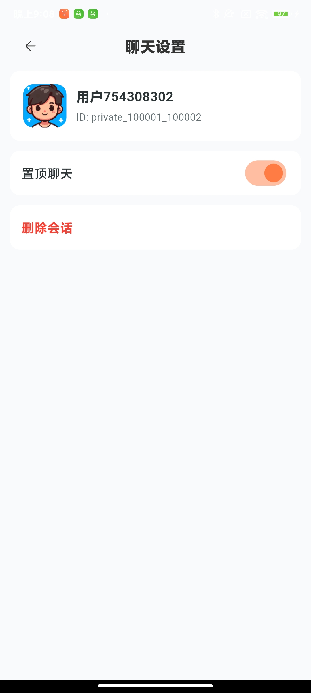
  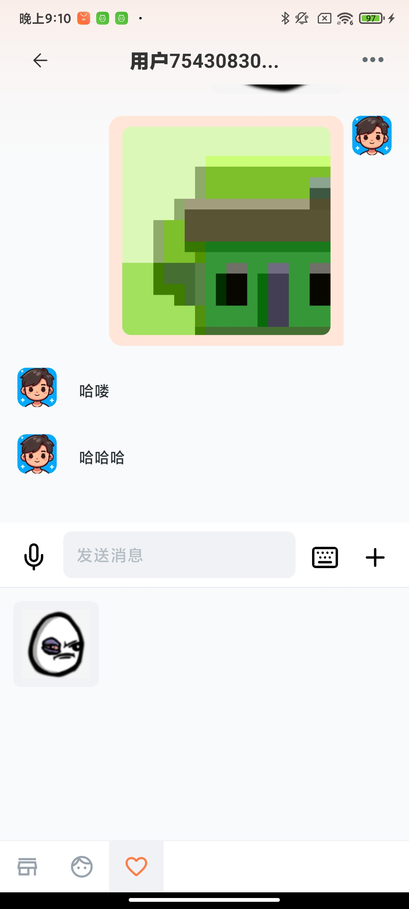
  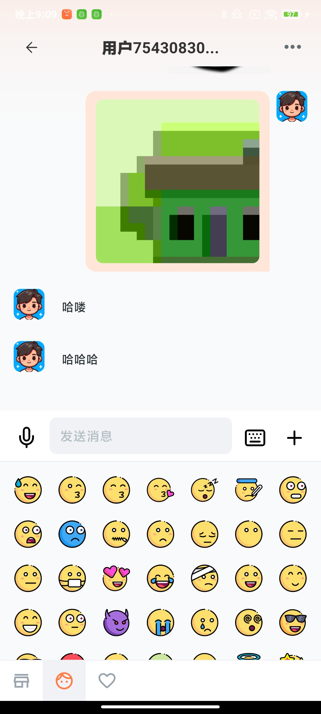

### 👥 社交功能

  
  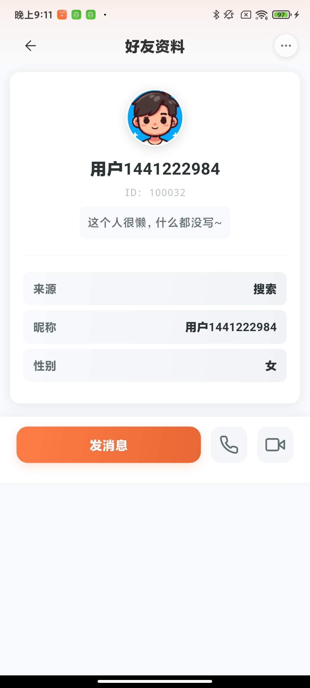
  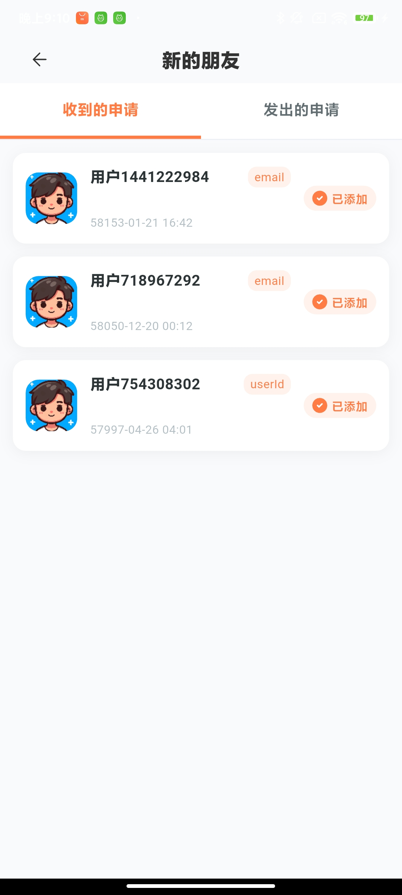
  

### 👥 群聊功能

  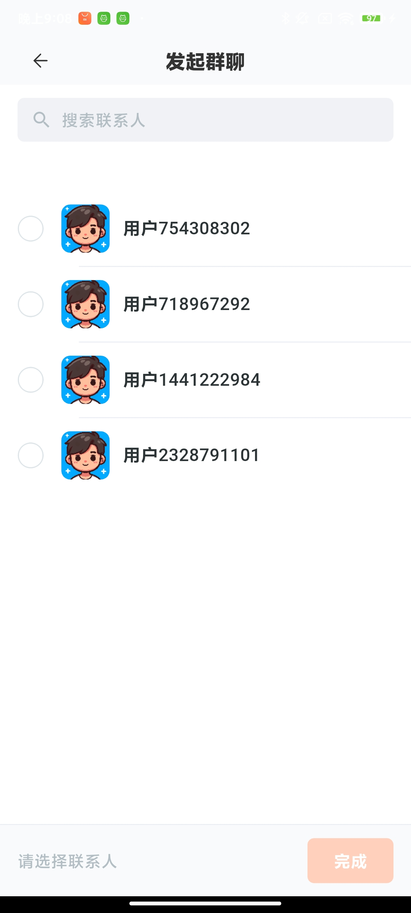
  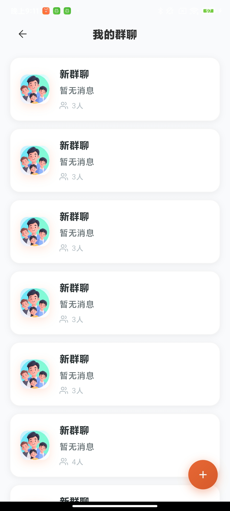

### ⚙️ 系统功能

  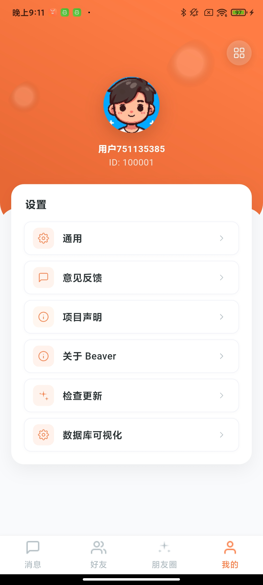
  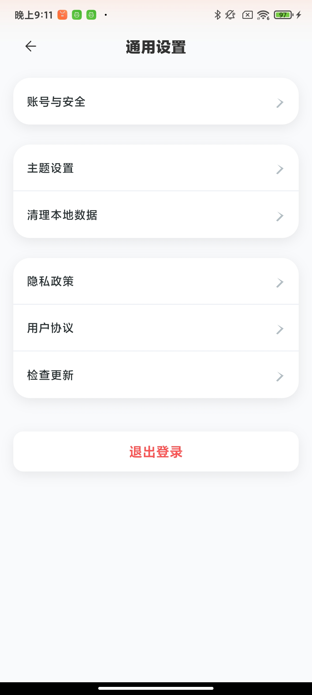
  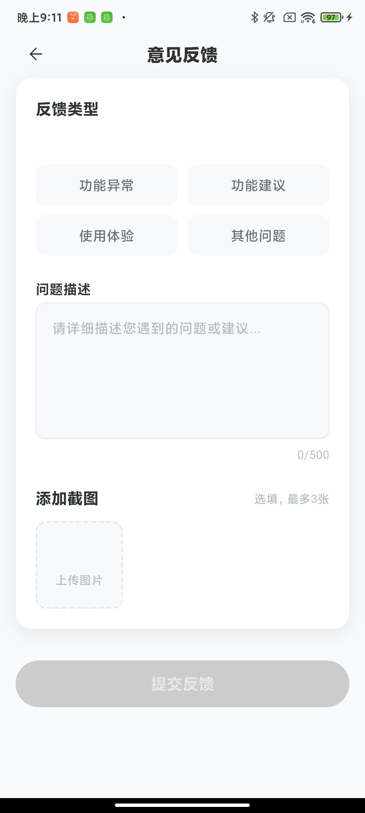
  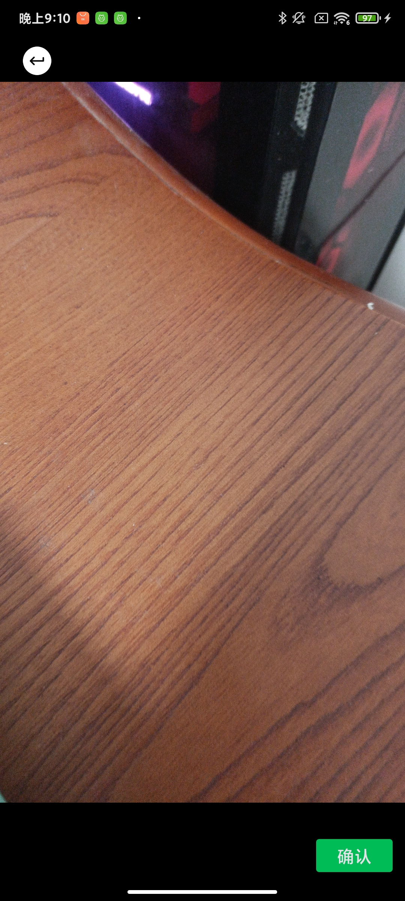
  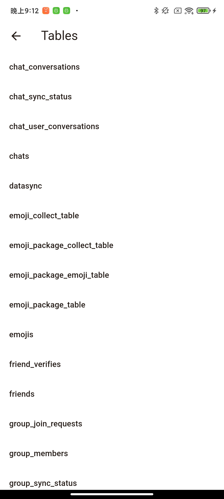

---

## 🚀 快速开始

### 环境要求

- Flutter >= 3.0.0
- Dart >= 3.0.0
- Android SDK 
- Xcode
- FVM (推荐用于 Flutter 版本管理)

---

## 🔗 相关项目

| 项目 | 仓库地址 | 说明 |
|------|----------|------|
| **beaver-server** | [GitHub](https://github.com/wsrh8888/beaver-server) \| [Gitee](https://gitee.com/dawwdadfrf/beaver-server) | 后端微服务 |
| **beaver-flutter** | [GitHub](https://github.com/wsrh8888/beaver-flutter) \| [Gitee](https://gitee.com/dawwdadfrf/beaver-flutter) | 移动端（Flutter，推荐）（本仓库） |
| **beaver-desktop** | [GitHub](https://github.com/wsrh8888/beaver-desktop) \| [Gitee](https://gitee.com/dawwdadfrf/beaver-desktop) | 桌面端（Electron） |
| **beaver-manager** | [GitHub](https://github.com/wsrh8888/beaver-manager) \| [Gitee](https://gitee.com/dawwdadfrf/beaver-manager) | 后台管理系统 |
| **beaver-open** | [GitHub](https://github.com/wsrh8888/beaver-open) \| [Gitee](https://gitee.com/dawwdadfrf/beaver-open) | 开放平台 |
| **beaver-oauth** | [GitHub](https://github.com/wsrh8888/beaver-oauth) \| [Gitee](https://gitee.com/dawwdadfrf/beaver-oauth) | OAuth 授权登录 |
## 📚 文档与帮助

- 📖 **详细文档**: [Beaver IM 文档](https://wsrh8888.github.io/beaver-docs/)
- 🎥 **视频教程**: [B站教程](https://www.bilibili.com/video/BV1HrrKYeEB4/)
- 📱 **体验包下载**: [海狸IM Android体验包](https://github.com/wsrh8888/beaver-docs/releases/download/lastest/latest.apk)
- 💬 **QQ群**:
  - [1013328597](https://qm.qq.com/q/82rbf7QBzO) - 群一 (已满)
  - [1044762885](https://qm.qq.com/q/82rbf7QBzO) - 群二
  - [1003121259](https://qm.qq.com/q/82rbf7QBzO) - 群三

## 🤝 贡献指南

我们欢迎所有形式的贡献！

1. Fork 本仓库
2. 创建特性分支 (`git checkout -b feature/AmazingFeature`)
3. 提交更改 (`git commit -m 'Add some AmazingFeature'`)
4. 推送到分支 (`git push origin feature/AmazingFeature`)
5. 开启 Pull Request

## ⭐ 支持项目

如果这个项目对你有帮助，请给我们一个 ⭐ Star！

## ☕ 请作者喝杯茶

如果这个项目对你有帮助，欢迎请作者喝杯茶 ☕

  
  

## 📄 开源协议与免责声明

本项目基于 [MIT](LICENSE) 协议开源 - 详情请参阅 [LICENSE](LICENSE) 文件。

### ⚖️ 使用说明

**项目定位**：本项目主要用于**技术学习和交流**，希望为开发者提供一个学习和研究的平台。

**使用建议**：
- 📚 **学习交流** - 欢迎用于个人学习、技术研究、学术交流
- 🤝 **开源贡献** - 欢迎提交代码改进、Bug修复、功能建议
- 🔒 **合规使用** - 请确保使用方式符合当地法律法规
- 💡 **创新应用** - 鼓励基于本项目进行创新性应用开发

**温馨提示**：
- 本项目采用 MIT 开源协议，您可以自由使用、修改和分发
- 建议在使用前仔细阅读相关法律法规，确保合规使用
- 如有疑问或需要帮助，欢迎通过 QQ 群或 GitHub Issues 交流

### 📋 项目来源标注要求

**重要**：如果您基于本项目进行二次开发或发布，**必须**在项目中保留以下信息：

#### 🖥️ **前端项目（移动端/桌面端/Web应用）**
- **关于页面**：必须在"关于我们"、"关于应用"或类似页面中包含项目来源标注
- **必需文本**："基于 [Beaver IM](https://github.com/wsrh8888/beaver-server) 开源IM项目开发"
- **链接**：必须提供可点击的原始项目链接

#### 🔧 **后端项目（服务器/API服务）**
- **README.md**：必须在项目介绍或描述中包含来源标注
- **必需文本**："基于 [Beaver IM](https://github.com/wsrh8888/beaver-server) 开源IM项目开发"
- **链接**：必须提供可点击的原始项目链接

#### 📄 **通用要求**
- **LICENSE 文件**：保留原项目 MIT 协议信息

> 💡 **友好提醒**：本项目允许个人及商业使用；基于本项目二次开发或发布时，**必须保留项目来源标注**，详见上方要求。

> 📖 **详细法律条款**：请参阅 [LEGAL.md](LEGAL.md) 文件了解完整的法律免责声明和使用要求。

## ⭐ Star历史

---

  <strong>Made with ❤️ by Beaver IM Team</strong> 
  <em>企业级即时通讯平台</em>

