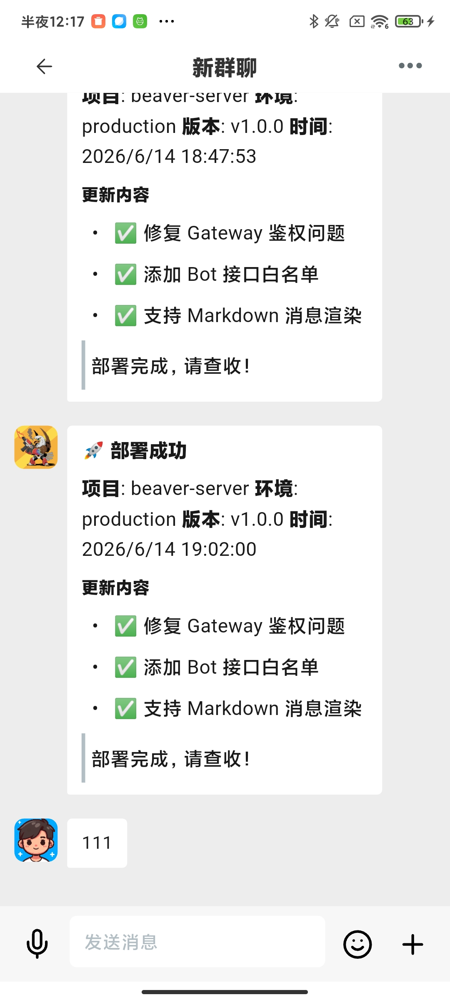
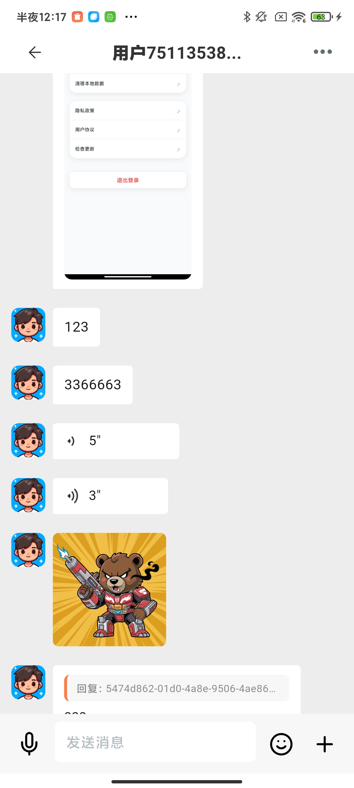
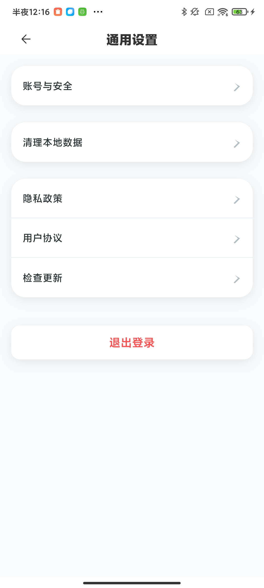
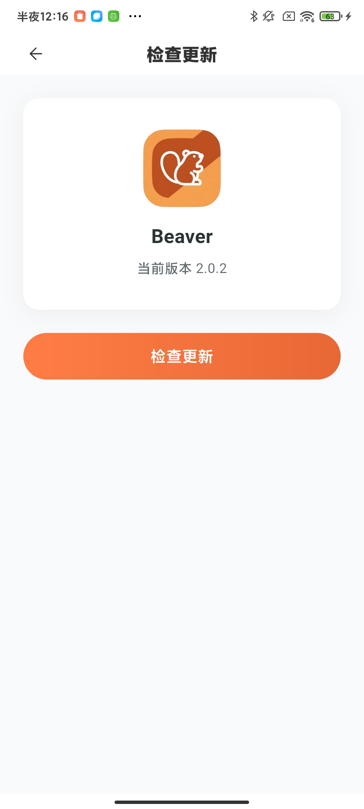
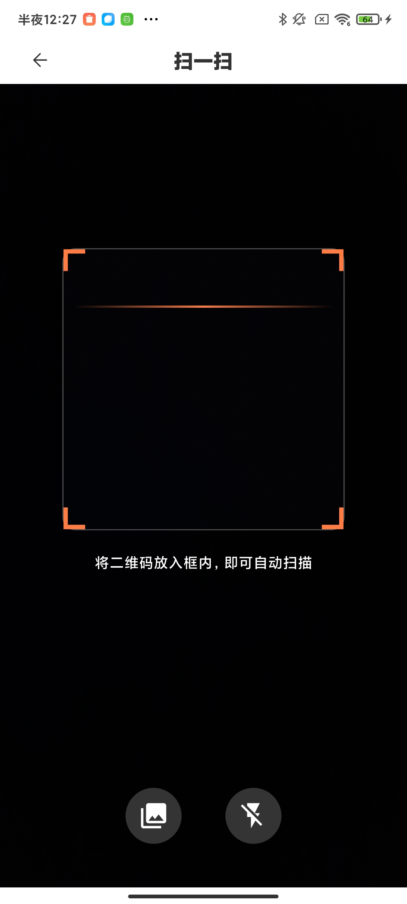

# 🦫 Beaver IM - Mobile Instant Messaging Client

> 🚀 **Modern Mobile Instant Messaging Application** - Built with Flutter + Dart, providing native mobile experience for Android/iOS/Web with complete social chat features.

**Current Version: [2.0.2](VERSION)** (see [`VERSION`](VERSION) at repository root, synced with `pubspec.yaml`)

[English](README_EN.md) | [中文](README.md)

---

## ✨ Core Features

- 🔐 User authentication (registration, login, password recovery)
- 💬 Instant messaging (private chat, group chat, text, images, emojis)
- 👥 Social features (friend management, QR code adding, friend notes)
- 🖼️ Multimedia support (image sending, file transfer, screenshot sharing)
- 📱 Multi-platform sync (real-time data sync between mobile and desktop)
- 🔄 Real-time communication (WebSocket long connection)

## 🛠️ Technology Stack

- **Flutter** 3.x - Cross-platform UI framework
- **Dart** 3.x - Type-safe programming language
- **flutter_bloc** - State management
- **Drift** - SQLite ORM
- **WebSocket** - Real-time communication
- **getIt** - Dependency injection
- **go_router** - Route management

---

## 📱 Screenshots

### 💬 Chat Features

  
  
  
  
  
  

### 👥 Social Features

  
  
  
  
  

### 👥 Group Features

  
  
  

### 🌐 Moments

  
  

### ⚙️ System Features

  
  
  
  
  
  

---

---

## 🚀 Quick Start

### System Requirements

- Flutter >= 3.0.0
- Dart >= 3.0.0
- Android SDK (for Android development)
- Xcode (for iOS development, macOS only)
- FVM (recommended for Flutter version management)

---

## 🔗 Related Projects

| Project | Repository | Description |
|---------|------------|-------------|
| **beaver-server** | [GitHub](https://github.com/wsrh8888/beaver-server) \| [Gitee](https://gitee.com/dawwdadfrf/beaver-server) | Backend microservices |
| **beaver-flutter** | [GitHub](https://github.com/wsrh8888/beaver-flutter) \| [Gitee](https://gitee.com/dawwdadfrf/beaver-flutter) | Mobile (Flutter, recommended) (this repo) |
| **beaver-desktop** | [GitHub](https://github.com/wsrh8888/beaver-desktop) \| [Gitee](https://gitee.com/dawwdadfrf/beaver-desktop) | Desktop (Electron) |
| **beaver-manager** | [GitHub](https://github.com/wsrh8888/beaver-manager) \| [Gitee](https://gitee.com/dawwdadfrf/beaver-manager) | Admin management system |
| **beaver-open** | [GitHub](https://github.com/wsrh8888/beaver-open) \| [Gitee](https://gitee.com/dawwdadfrf/beaver-open) | Open platform |
| **beaver-oauth** | [GitHub](https://github.com/wsrh8888/beaver-oauth) \| [Gitee](https://gitee.com/dawwdadfrf/beaver-oauth) | OAuth authorization |

## 📚 Documentation & Help

- 📖 **Detailed Documentation**: [Beaver IM Docs](https://wsrh8888.github.io/beaver-docs/)
- 🎥 **Video Tutorial**: [Bilibili Tutorial](https://www.bilibili.com/video/BV1HrrKYeEB4/)
- 📱 **Experience Package Download**: [Beaver IM Android Experience Package](https://github.com/wsrh8888/beaver-docs/releases/download/lastest/latest.apk)
- 💬 **QQ Groups**:
  - [1013328597](https://qm.qq.com/q/82rbf7QBzO) - Group 1
  - [1044762885](https://qm.qq.com/q/82rbf7QBzO) - Group 2
  - [1003121259](https://qm.qq.com/q/82rbf7QBzO) - Group 3

## 🤝 Contributing

We welcome all forms of contributions!

1. Fork this repository
2. Create a feature branch (`git checkout -b feature/AmazingFeature`)
3. Commit your changes (`git commit -m 'Add some AmazingFeature'`)
4. Push to the branch (`git push origin feature/AmazingFeature`)
5. Open a Pull Request

## ⭐ Support Project

If this project helps you, please give us a ⭐ Star!

## ☕ Buy Me a Coffee

If this project helps you, welcome to buy me a coffee ☕

  
  

## 📄 License & Legal Disclaimer

This project is licensed under the [MIT License](LICENSE) - see the [LICENSE](LICENSE) file for details.

### ⚖️ Usage Guidelines

**Project Purpose**: This project is primarily designed for **technical learning and communication**, aiming to provide developers with a platform for learning and research.

**Usage Recommendations**:
- 📚 **Learning & Communication** - Welcome for personal learning, technical research, academic exchange
- 🤝 **Open Source Contributions** - Welcome code improvements, bug fixes, feature suggestions
- 🔒 **Compliant Usage** - Please ensure usage complies with local laws and regulations
- 💡 **Innovative Applications** - Encourage innovative application development based on this project

**Friendly Reminders**:
- This project uses the MIT open source license, allowing you to freely use, modify, and distribute
- We recommend reading relevant laws and regulations before use to ensure compliance
- If you have questions or need help, feel free to reach out via QQ Group or GitHub Issues

### 📋 Project Attribution Requirements

**Important**: If you develop or publish based on this project, you **must** retain the following information:

#### 🖥️ **Frontend Projects (Mobile/Desktop/Web Apps)**
- **About Page**: Must include project source attribution in "About Us", "About App", or similar pages
- **Required Text**: "Based on [Beaver IM](https://github.com/wsrh8888/beaver-server) open source IM project"
- **Link**: Must provide clickable link to the original project

#### 🔧 **Backend Projects (Server/API Services)**
- **README.md**: Must include attribution in the project introduction or description
- **Required Text**: "Based on [Beaver IM](https://github.com/wsrh8888/beaver-server) open source IM project"
- **Link**: Must provide clickable link to the original project

#### 📄 **General Requirements**
- **LICENSE file**: Retain the original project MIT license information

> 💡 **Friendly Note**: Personal and commercial use are permitted. When developing or publishing based on this project, you **must retain project attribution** as described above.

> 📖 **Detailed Legal Terms**: Please refer to [LEGAL.md](LEGAL.md) for complete legal disclaimers and usage requirements.

## ⭐ Star History

---

  <strong>Made with ❤️ by Beaver IM Team</strong> 
  <em>Enterprise Instant Messaging Platform</em>

